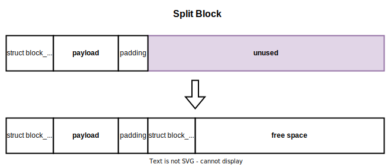

# Example - Memory Allocator

To better understand how to plan and structure a project, let us walk through the [Memory Allocator project](https://github.com/open-education-hub/operating-systems/tree/main/content/assignments/memory-allocator), from the [Operating Systems repository](https://github.com/open-education-hub/operating-systems/) step by step.

## Storing the Project

The project structure adheres to what we described earlier, with the mention that the `assets/` corresponds to `media/` and `tests/` corresponds to `checker/`.

```bash
|-- README.md
|-- assets (media)
|   |-- coalesce-blocks.svg
|   |-- memory-block.svg
|   `-- split-block.svg
|-- utility
|   |-- printf.c
|   `-- printf.h
|-- skeleton
|   |-- Makefile
|   |-- helpers.h
|   |-- helpers.c
|   `-- osmem.h
`-- tests (checker)
    |-- Makefile
    |-- src
    |-- ref
    `-- checker.py
```

### Project Statement

The project statement begins by outlining the key concepts a learner should understand upon project completion.
It also provides a brief project description and introduces the directory structure.

```md
## Objectives

- Learn the basics of memory management.
- Accommodate with the memory management syscalls in Linux.
- Understand the bottlenecks of memory allocation and how to reduce them.

## Description

Build a minimalistic memory allocator that can be used to manually manage virtual memory.
The goal is to have a reliable library that accounts for explicit allocation, reallocation, and initialization of memory.

## Support Files

The support files consists of three directories:

- `skeleton/` will contain your solution
- `tests/` contains the test suite and a `Python` script to verify your work
- `utils/` contains an implementation for `printf()` function that does **not** use the heap
```

The following two sections, namely `API` (Application Programming Interface) and `Implementation`,` offer descriptions of the tasks.
While these titles are customized to suit the project's **Computer Science** context, they could easily be combined into a single section with a more generic title like `Tasks`.

The `API` section gives a brief an overview of the tasks, specifying their requirements without going into deep details.
It concludes with some general insights that are not tied to individual tasks but contribute to enhancing the overall project workflow.

```md
## API

1. `void *os_malloc(size_t size)`

   Allocates `size` bytes and returns a pointer to the allocated memory.

1. `void *os_calloc(size_t nmemb, size_t size)`

   Allocates memory for an array of `nmemb` elements of `size` bytes each and returns a pointer to the allocated memory.

1. `void *os_realloc(void *ptr, size_t size)`

   Changes the size of the memory block pointed to by `ptr` to `size` bytes.
   If the size is smaller than the previously allocated size, the memory block will be truncated.

1. `void os_free(void *ptr)`

   Frees memory previously allocated by `os_malloc()`, `os_calloc()` or `os_realloc()`.

1. General

   - You are allowed to use `sbrk()` instead of `brk()`, in view of the fact that [on Linux](https://man7.org/linux/man-pages/man2/brk.2.html#NOTES) `sbrk()` is implemented using the `brk()`.
   - You must check the error code returned by every syscall.

```

The `Implementation` section provides guidance on how to address particular implementation aspects.
Its aim is to ensure that all solutions align with the checker's requirements and adhere to consistent conventions.
This section is also where we introduce new concepts.
We explain these concepts by connecting them to previously explained material and highlighting their significance.
To support our explanations, we include media files and references to promote deeper understanding.
These references can be found in the `Resources` section.

In the context of the `Memory Allocator` project, one such concept is the `Split Block`.

```md
## Implementation

[...]

#### Split Block

Reusing memory blocks improves the allocator's performance, but might lead to [Internal Memory Fragmentation](https://www.tutorialspoint.com/difference-between-internal-fragmentation-and-external-fragmentation#:~:text=What%20is%20Internal%20Fragmentation%3F).
This happens when we allocate a size smaller than all available free blocks.
If we use one larger block the remaining size of that block will be wasted since it cannot be used for another allocation.

To avoid this, a block should be truncated to the required size and the remaining bytes should be used to create a new free block.
```



Once the project tasks have been thoroughly explained, our focus shifts to the submission and grading process.
In this section, we provide details about the prerequisites for using the `checker` and offer an illustrative example of a successful run.

```md
## Testing and Grading

The testing is automated and performed with the `checker.py` script from the `tests/` directory.

Before running `checker.py`, you first have to build `libosmem.so` in the `skeleton/` directory and generate the test binaries in `tests/bin`.
```

```console
student@os:~/.../assignments/mem-alloc/tests$ make
gcc -I../utils -fPIC -Wall -Wextra -g -o bin/test-all src/test-all.c -L../allocator -losmem
gcc -I../utils -fPIC -Wall -Wextra -g -o bin/test-calloc-arrays src/test-calloc-arrays.c -L../allocator -losmem
[...]
```

### Support Files

The skeleton files are:

- `Makefile` which automates the process of building the solution
- `osmem.c` and `osmem.h`, which serve as templates for learners to work on.
  Learners are expected to write their code in the designated **TODO** sections, which follow the structure described the `API` and `Implementation` sections.

```C
void *os_malloc(size_t size)
{
	/* TODO: Implement os_malloc */
	return NULL;
}

void os_free(void *ptr)
{
	/* TODO: Implement os_free */
}

void *os_calloc(size_t nmemb, size_t size)
{
	/* TODO: Implement os_calloc */
	return NULL;
}

void *os_realloc(void *ptr, size_t size)
{
	/* TODO: Implement os_realloc */
	return NULL;
}
```

### Utility Files

In this project, we have utilized the `utility/` directory to offer an alternative implementation for a commonly used function, `printf()`.
This approach simplifies the design of the memory allocator and prevents lengthy output, resulting in a more instructive project.
These files are not supposed to be changed and do not affect the grading process.

### Automated Validators

These files are located in the `tests/` directory.
This naming choice deviates from the conventional `checker/` name, primarily due to compatibility issues with the grading platform we used, but the structure remains consistent.

The program used to grade the project's solution is named `checker.py`.
Behind the scenes, this program utilizes sample C programs located in the `tests/src/` directory, which it links with the dynamic library created by the learners.
Subsequently, it executes the resulting binary and verifies whether it makes the correct system calls.
This verification is done by comparing the system calls made by the binary to those listed in a reference file situated in the `tests/ref/` directory.

If the program's output does not match the reference files, the checker provides a list of discrepancies.
These discrepancies serve as hints for the learners, indicating where the differences between the expected and actual outputs exist.

## Good Practices

Drawing from our experience, we offer the following recommendations:

1. When designing the assignment, prioritize its educational value over its length.

   This approach ensures that the assignment reflects real-world situations rather than resorting to shortcuts to make it more manageable.
   If the assignment turns out to encompass too much content for the given timeframe, consider dividing it into multiple projects or designating certain tasks as bonus.
   The key principle here is to prioritize consistency and quality to deliver an authentic learning experience.

1. Develop the project statement simultaneously with the reference solution.

   This approach guarantees that the project statement encompasses all necessary elements and provides an estimate of the time needed to complete the project.
   urthermore, grading and submission workflows can be improved based on the reference solution.

1. Implement Feedback Loops

   It's beneficial to involve someone external to the development team to review the proposed points.
   Ask them to assess the simplicity of the workflow, the clarity of the questions, and estimate the time required for completion once in a while.

   As the project approaches its final stages, have several individuals attempt to solve it while support is available.
   This helps prepare the infrastructure and may lead to project statement improvements based on their questions and feedback.
