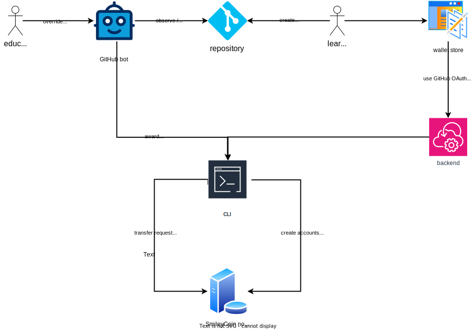

# Digital Rewards

Teaching paradigms often involve the use of a reward system to incentivize learners to study.
To enable such teaching techniques, we offer an infrastructure for cryptocurrency rewards with the purpose of stimulating both learning and contributions to the educational content.
This approach has been used to stimulate learning as part of our past education adventures, and we consider it a welcome addition to the arsenal of motivational items of educators.
We provide the tools and support to use it, to the specifics of each educator or group of learners.

Rewards may be used at different steps in the learning process:

- when a learner correctly completes a designated teaching activity: a drill or set of drills, an assignment, an exam etc.
- when a learner contributes content to the existing repository
- when a learner reviews a contribution
- when a learner helps his peers (by publicly answering questions or helping them during practical sessions)

Choosing the items for which rewards are offered is a subjective decision depending on personal preference and cultural background.
However, from a usability perspective, there are two categories of rewards:

- those that can be awarded automatically (e.g. a learner solves a multiple choice question)
- those that are awarded manually (e.g. a learner has answered a verbal question during a lecture)

To account for these situations, we have developed an infrastructure that uses an educational cryptocurrency that may be awarded automatically or manually.
We use the [SmileyCoin](https://smileycoin.work/) educational cryptocurrency for that purpose.
SmileyCoin is a publicly traded cryptocurrency and are it is worth close to nothing in terms of fiat currency.
The infrastructure is implemented as part of two repositories:

- the [`smileycoin-node` repository](https://github.com/open-education-hub/smileycoin-node), that mediates the transactions
- the [`smileycoin-api` repository](https://github.com/open-education-hub/smileycoin-api), that offers the tools to send and receive

However, by offering certain prizes for specific SmileyCoin amounts, we can incentivize learners to self-study or to contribute to our repositories (as a mean of learning).
The prizes that are being offered may vary, depending on the available resources of the entity that uses the course.
SmileyCoin is to be used as rewards for learners may be obtained by simply buying them (1.000.000 SmileyCoin equals ~50 euros) or, in case that is not possible, by asking the [SmileyCoin Fund](https://smileyco.in/#/details) for a donation.

To use the system, the following steps need to be taken:

- The awarding entity sets up [a wallet](https://wallet.smileyco.in/?network=smileycoin) and deposits some SmileyCoin in there.
- The potential receivers also create a wallet.
- Once an activity for which SmileyCoin is awarded is completed, the awarding entity sends an amount of SmileyCoin to the receiver.

We recommend the use of the [`Coinomi` wallet](https://github.com/open-education-hub/smileycoin-api/wiki/Student-Handbook#1-download--set-up-coinomi).
It's popular and it can be used to store different cryptocurrencies, not just SmileyCoin.

For the awarding entity to be able to send the necessary SmileyCoin, it is required that the receivers wallet address be known.
As a consequence, the receiver needs to publicize his wallet address.
As such, for SmileyCoin awarded automatically, the receiver needs to have an account that is associated with his wallet on the platform where the activity is performed (either a GitHub account for contributions or a platform account on the hosting service - such as TutorWeb).
For SmileyCoin that is awarded manually, the receiver may simply communicate the receiving wallet address.

The workflow is presented in the diagram below:

Currently, we have implemented an infrastructure around SmileyCoin, as part of the [`smileycoin-api` repository](https://github.com/open-education-hub/smileycoin-api).
The infrastructure presents documentation:

- for [educators](https://github.com/open-education-hub/smileycoin-api/wiki/Student-Handbook)
- for [learners](https://github.com/open-education-hub/smileycoin-api/wiki/Teaching-Assistant-Handbook)
