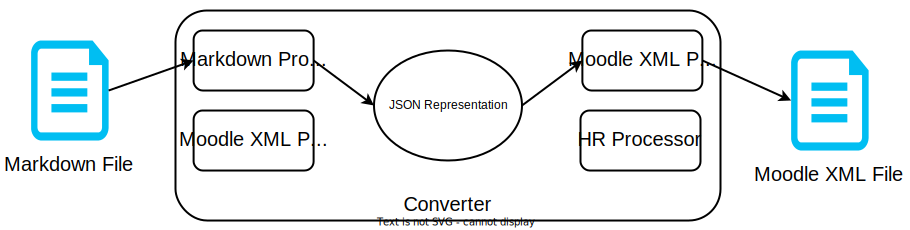

# Methodology

The Open Education Hub methodology contains all of the guidelines for creating high quality, open source educational materials.
The methodology describes the types of content, how the content is used in the various stages of teaching and the required infrastructure.
All the educational content is open source and all of the used tools are either open source or free to use.

## Types of Content

This chapter describes the various forms that the educational content may take form.
Each section details how a specific type of content is to be developed, stored and used.

### Reading

The reading content type is the most common form of storing educational material (or information, in general).
As the name suggests the content is developed to be read, therefore it comes in the form of text.

To develop reading content we use the [Markdown syntax](https://www.markdownguide.org/basic-syntax) and the following guidelines:

- the heading level of a title is given by the number of `#`s that precede it.
For example, the title of a document is preceded by a single `#`, whereas the chapters are preceded by two.
- each sentence is written on a new line.
- paragraphs are separated by an empty line.
- links should be used as hyperlinks by using the `[]()` syntax as in [this example](https://theuselessweb.com/).

To enforce the guidelines we use [automated linter checks](https://github.com/super-linter/super-linter#readme).
Besides the mentioned guidelines, the linter implements checks for other minor style conventions (such as how to define lists, where should new lines be placed and others).
However, for the majority of cases, the above should be sufficient.

When developing such materials we recommend that:

- the reading material be concise, following the "less is more" principle.
- the first sentence of each section describe what is the intended purpose of the section.
- if the reading material can be expressed in a more visual manner, the latter is preferred.

### Media

The media content type refers to audio, visual or audiovisual educational materials.
Images, videos, audio files, educational video games represent examples of such content.

The media content type represents an easily digestible format for presenting information.
As such, media is typically embedded within the text that is destined reading, slides, demos, practice items and projects.

When developing media items, it is important to follow the guidelines below:

- use an open source or free development tool.
- store both the output (the actual image, video etc.) and the editable building blocks.

#### Images

For the creation of images and diagrams we use [draw.io](httpts://draw.io).
`draw.io` is a free, easy to use tool that offers a variety of useful icons and building blocks.
Additionally, it is available in the browser, which makes it accessible on the majority of today's devices.
The resulting images can be exported in different formats, such as PDF, PNG or SVG.
When storing images, it is important that both the source file (with the extension `drawio` or `svg`) and the immutable output (PDF, PNG, JPG) are stored.
By doing so, the potential users of the content can either use the image as is or modify it according to their needs.
Note that other tools for the generation of images may be used as long as they are free and provide the source file.

One particular type of image is a screenshot.
Screenshots are not editable and need to be retaken if a modification is necessary.

#### Audio-video Recordings

Audio or video content is by its nature hard to modify.
Typically, if a video/audio recording requires alterations, it is re-recorded.
As such, the video/audio recording is stored as is and if modifications are required, it needs to be recreated.
In terms of the tools that can be used to create such recordings, given the variety of options, we do not give any specific recommendations.
Any device that can record at a decent quality is fine.

There is a particular type of video that can be created without using a camera.
By putting multiple similar images in a slideshow and automating the presentation, the video effect can be achieved.
This sort of video is useful for educational material that presents processes or phenomenons step by step.
To create such videos, we need to first create the images and then bundle them up using [ffmpeg](https://ffmpeg.org/).
In this situation the image source files, the actual images and the video need to be stored in the content repository.

#### Interactive Applications

Some educational scenarios involve the learner to interact with a specific application.
The application can be a video game, a web page or even a simple computer program that simulates a given context.
For such situations, the code of the application should be stored alongside the information regarding the tools that are necessary to build the application.
Since this type of content involves a broad range of tools that could be employed, we simply recommend using free and open technologies.

### Slides

Slides are the main support material for live activities, such as lectures.
They can also be used during practical sessions or talks (such as conferences).
The main role of slides is to provide the visual support material for presenting information and engaging participants in discussions.
Slides are a sequence of pages to be shown live on projector screen, each presenting a given idea.
The lecturer typically walks through slides and presents information by expanding ideas on the slides, and by engaging in discussions based on those ideas.

Slides should ideally have the following properties:

- be visually appealing
- be relevant to the presenter and to the audience
- be ergonomic, easy to observe and to understand
- be dynamic, digestible, show visual information being constructed
- be easy to create by content developers
- as with other Open Education Hub content types, allow easy improvements and contributions

#### reveal-md

Our choice of engine for storing and rendering slides is [reveal-md](https://github.com/webpro/reveal-md).
reveal-md is based on [reveal.js](https://revealjs.com/) and allows the development of web-rendered sleek slides.
Moreover, as with other content types used at Open Education Hub, it uses Markdown format.
reveal-md fits well with the properties above and, because it uses Markdown, it can be stored in a Git / GitHub repository and, thus, allows easy improvements and contributions.

TODO: features of reveal-md
links to documentation, syntax items

To have modular contents for slides, we use [markdown-pp](https://github.com/amyreese/markdown-pp) (for Markdown Preprocessor).
With markdown-pp we have an index file for slides;
the index file includes actual Markdown files representing sections.

TODO: features of markdown-pp
links to documentation

potential items for the future, potential replacement of markdown-pp

#### Slide Directories

structure slides in directories as slide decks, following a structure / narative for the section / chapter

typical structure of slide directory:

- slides.mdpp: actual slides
- slides/: per section reveal-md Markdown files
- Makefile: generate output files (HTML, PDF)
- media/: media files, as discussed in [`Media` section](#media)

output files are:

- slides.md: intermediary aggregated output file (after markdown-pp processing)
- slides.pdf: PDF output file;
  to be viewed with PDF reader
- `_site/`: HTML output;
  open `_site/index.html`;
  to be viewed with web browser

#### Presenting Slides

2D view of slides for `markdown-pp`

keyboard shortcuts

#### Slide Contents

index slide

slide types:

- section title slides
- media slides

horizontal and vertical slides

slide titles

content types: text, bullets, code, tables

animations, highlights;
wherever possible, text should be replaced with images and animations

### Questions

Questions verify specific information and must be verifiable automatically.
Therefore, this section covers multiple-choice or simple answer questions, such as a word or a number.
On the other hand, open-ended tasks such as essays, that are difficult to verify automatically, are considered [drills](#drills) instead.

Questions may be a form of live checks (as part of lectures or labs), self-study or formal examination.
They provide a means to evaluate learner understanding.
This creates a positive feedback loop between trainers and trainees whereby both can track the learners' progress in real time.

Furthermore, questions serve as practice items for learners to solve at their own pace, in conjunction with [drills](#drills).
They may also be used for evaluation items that contribute to the learners' overall grade.

Another desired aspect is that questions be easily extractable and convertible between formats, as described [below](#deployment), and repurposed by other trainers.

Despite all of their strengths, questions also come with a few shortcomings.
One such downside is the binary nature of the feedback loop.
Because question grading is automated, it is harder for the feedback that learners receive to pin-point the exact step that they got wrong and focus on that.
Said feedback may be however detailed enough for learners to figure this out themselves.
In addition, non-technical fields of study may find little benefit in questions as they rely more on arguments essays rather than concrete, technical information.

Even after accounting for these downsides, questions are an easy and automated way to provide quick feedback regarding learner knowledge, both to educators and to learners themselves.

#### Steps to Develop a Question

To create a new question from scratch, a educator should:

1. Brainstorm the question.

1. Write it down using the Open Education Hub format proposed in this document.

1. Push it to the repository.

1. Convert it to the required publisher format.

1. Publish and deploy it to the desired platform.

#### Deployment

Each trainer uses a specific teaching rendering platform.
Most platforms support questions in various formats, such as whether they are graded or ungraded, whether the answers are multiple choice or text boxes, etc.
Out of the existing teaching platforms, a few highlights are:

- [Moodle](https://moodle.org/) is a free open-source learning platform dedicated to course management.
  It supports graded assignments, quizzes, storing teaching materials and many other educational activities.

- [SmileyTutor (formerly called TutorWeb)]((https://tutor-web.net/)) is another free learning platform whose highlight is that it was built around the [SmyleyCoin cryptocurrency](#cryptocurrency-rewards) as a reward for completing drills and questions.

- [tech.io](https://tech.io/) is another platform for presenting questions as quizzes.
  More simplistic than Moodle or SmileyTutor, it allows educators to easily create _playgrounds_, which are learning environments designed around specific subjects, made up of reading material, followed by practical exercises and questions.

- [Kahoot!](https://kahoot.it/) is another platform for hosting multiple-choice quizzes.
  These quizzes are called games and can be created either from scratch, or by using Kahoot's existing question bank.
  Creating Kahoots from scratch is difficult to automate because the platform requires submitting questions individually into a webpage.

Each of these platforms supports a different syntax for uploading questions.
To make our questions comply with educational platforms easily, we need to store them in a generic format that is easily representable and automatically convertible to other required formats.
For this reason and for the sake of consistency, we are storing questions in the same Markdown format as all of our written material.

We are developing a modular and easily extendible converter that ports questions from Markdown to other formats.
The format that we use to store questions is easily convertible to other formats.
Therefore, we do not implement converters for all the existing formats.
Instead, we do provide a program that is easily extendible to support any kind of format.

The converter becomes a collection of processors whose job is to change the layout of a given file between formats.
Either their input or their output is a dictionary JSON representation.
In addition, each converter is bi-directional, being capable of converting either from a format to JSON or vice-versa.
The image below displays how a file is converted from Markdown to Moodle XML.
Any other format follows a similar route: `file in format A -> format A converter -> JSON -> format B converter -> file in format B`.



#### Storage Format

We are using Markdown as a generic storage format for questions because it is a text-based format, so it is suitable for written questions.
Unlike more complex formats like LaTeX, Markdown offers a much simpler syntax which makes questions easier to contribute to by educators and learners alike.

The format we propose relies on headers to represent categories such as difficulty, topics, question text, feedback.
Each question has a title written on the first line as a level 1 header (`#`).
Each category is specified as a level 2 header (`##`).
The contents of the category consist of the text beneath the header.
For multiple-choice questions, correct answers are marked as list entries starting with `+`, while incorrect ones are marked with `-`.

Every question will be stored in a separate Markdown file.
See the example below:

```text
# Sample Question Name

##  Difficulty

easy

## Tags

- topic-1

- topic-2

## Question Text

Is this a sample question?

## Question Answers

+ Yes

- No

- Maybe

## Feedback

The question is self-reflecting and its title is "Sample Question Name", so it is a sample question.
```

Note that correct answers are marked as list entries starting with `+`, while incorrect ones are marked with `-`.
There may be multiple correct answers.
In addition, the headings starting with `##` are just keys for different sections of the question.
Therefore, none of them are mandatory given our format and the developer is free to add or remove any of them.

A typical question is to be stored in a separate directory within the repository, with the following components:

- `question.md`: the Markdown file containing all question-related information, formatted as specified above
- `media/`: optional media files (images, videos, etc.) required by the question

Therefore, the directory structure of a typical question is a follows:

```text
sample-question/
├── question.md
└── media/
    ├── image.svg
    ├── ...
    └── video.mp4
```

#### Converter

Given the format above, we are providing a converter that can reformat questions from one format to another.
It is bidirectional, so it can translate between any two formats, such as Markdown, [Moodle XML](https://docs.moodle.org/402/en/Moodle_XML_format), etc.
If a new question format is desired, the converter may be easily extendable to accommodate it and convert between it and any other format.

The converter achieves this level of flexibility by internally representing each question as a dictionary (a list of key-value pairs), from which any other format can be derived.
The keys of this dictionary are the `##` headings and the value of each key is the text beneath the heading.
This also allows the converter to support a [JSON format](https://blog.hubspot.com/website/json-files) for free, as it is directly mapped to the converter's internal representation.
For example, the sample question above will be represented as a JSON as follows:

```json
"Sample Question Name": {
    "Difficulty": "easy",
    "Tags": ["topic-1", "topic-2"],
    "Question Text": "Is this a sample question?",
    "Question Answers": ["Yes", "No", "Maybe"],
    "Correct Answer": "Yes",
    "Feedback": "The question is self-reflecting and its title is \"Sample Question Name\", so it is a sample question."
}
```

#### Usage

To use this converter, a person is required to run the command below.
The script will infer the fact that the input format is Markdown and the output is Moodle XML from the extensions of the input files (`.md` and `.mxml`).

```console
python3 question_converter.py convert -i input_file.md -o output_file.mxml
```

The converter may also be run by the builder if the educator desires to integrate questions within their published course and not use a third party hosting website, such as those outlined [in the Deployment section](#deployment).
If this integration is desired, it is up to the educator to configure the builder accordingly.

### Drills

### Guides

Guides are pieces of content consisting of detailed steps that are commonly used in practice.

Guides are to be used by learners as tutorials, part of the learning process.
They can be used as tutorial during practical session, with assistance provided to further explaining certain items, or as unassisted self-study.

Guides can also by educators when demonstrating a topic or showcasing a real-world scenario to a live audience.
These demos are typically good ways to capture the attention of learners due to their real-world nature.

Guides consist of:

- text: created by following the guidelines in the ["Reading" section](#reading)
- media: created by following the guidelines in the ["Media" section](#section)
- support files: source code, skeleton files, application support files, fill-in-the blanks, templates

A learner would read the text, view media files and use (hands-on) practice files to get replicate a practical result present by the guide.
When used by an educator as a demo, support files are used for the live delivery;
text and media are used by the educator to prepare before delivery.

TODO: sample guides

#### Guide Directory Structure

- `contents.md`
- `media/`
- `support/` - source code, skeleton files, application support files, fill-in-the blanks, templates

#### Guide Contents

Expected contents

Best practices

Start with the goals, present the expected outcome first

Present the resources

Do it step by step, make it digestable

Clear and complete instructions

Highlight the relevance of the result

### Projects

## Teaching Stages

This chapter describes how each teaching activity is mapped to different types of content.
Put differently, it shows how each content type is to be used in the various teaching stages.

### Lectures

Lectures are teaching activities that typically take place with a larger audience and are asymmetrical: a lecturer mostly talks while the audience mostly listens.
Interactivity is important but is limited by the larger audience: not all participants will be able to actively engage in conversations;
however, items that don't require conversation, such as quizzes, are a good way to engage all participants, as we discuss below.
Practical sessions, on the other hand, put participants in the position where they work on concrete items, and get involved in smaller groups discussions, with a more symmetrical interaction.

Lectures benefit from content materials that can be used by educators as preparation and / or during the actual delivery.
In the following sections, we detail steps in preparing and (re)using lecture materials in Open Education Hub.

#### Lecture Materials

We organize lecture materials according to lecture-specific activities.
We reference them as presented in the ["Types of Content" section](#types-of-content).

- **Visual support materials** are used as support material for giving talks and engaging participants in discussions.
  They consist of:

  - [**Slides**](#slides) are the typical structured and simplified format for organizing ideas.
    The lecturer walks through slides and presents information by expanding ideas on the slides, and by engaging in discussions based on those ideas.

  - [**Media files**](#media) are generally images or videos that represent a concept in an easier to grasp format.
    Diagrams, photos, recordings of actions / processes, recorded simulations fall under this category.
    They can be used either stand-alone or embedded into slides.

- **Practical support materials** are used to demonstrate actual real-world applications of presented concepts.
  The lecturer is the one who uses the practical support materials to do live demonstrations and highlight concrete use cases.
  This may not be possible for certain topics, either because they are highly theoretical or because it is difficult to have a live setup.
  Where a live demonstration is not possible, a video recording (as a visual support material) may be used.
  They consist of [**Guides**](#guides) used for demos.

- **Assessment materials** are used to evaluate the knowledge and skills of participants, and to provide feedback on spots they need to focus more on.
  Typically they are to be used live during lectures, with their results providing immediate feedback and triggering discussions.
  They consist of [**Quizzes**](#quizzes).

- **Offline self-study materials** are to be used by participants outside lectures.
  They are detailed in the ["Self-Study" section](#self-study).

As other types of content, lecture materials are publicly available, and also open to contributions.
Lecture materials are meant to be used live by educators during lectures and then offline by learners, to improve gained knowledge and skills.
Visual support materials are directly available on the course website;
the other materials are available either as downloadable archives or directly in the course repository.

#### Lecture Content Structure

Educators have individual styles and preferences.
Hence, they would define their preferred order of presenting topics and decide on the weight of each topic.

Even so, it is recommended that the types of materials shown above be intertwined during an actual lecture.
Slides are good for presenting general topics, but tend to become tern and difficult to follow.
As such, spreading demos and quizzes between slides is great to engage the audience and also provide a practical overview of items and an insight into topics that deserve continued attention.

One possibility is to have lectures focused primarily on demos and on quizzes and slides to be used sparingly, only as topic highlights.

In the ideal case, each topic in a lecture will feature a balanced mix of demos, quizzes, slides and media files.
Some items may be left out altogether, such as having a lecture consisting of demos and quizzes only, without using slides.
The dedicated educator will be careful to adjust the types of content to the topic being presented and to the audience.

#### Evaluating Lecture Content

It is difficult to evaluate lecture content without including the educator delivery method itself.
A charismatic educator will likely get good learner feedback even with low-quality lecture content.

Even so, there are several metrics that we recommend to be considered:

* Good quiz grades (during lectures) are generally a sign that the respective topics are well presented.

* Good assignment grades and fewer technical assignment clarifications requested by learners mean that the topics for assignments were well covered during lectures.

* Website accesses for particular materials signal the topic is deemed well presented by learners (and others - as it is public content).

* Good exam grades for corresponding topics mean materials are well structured.

* Learner feedback that is specifically directed at content (i.e. excluding educator delivery methods) is used to highlight general quality of the content and a comparison among different topics.

* A rating system (stars) can be added to materials to get quick input from learners.

### Practical Sessions

Practical sessions are represented by hands-on activities that learners perform in order to acquire experience.
These activities are typically supervised by an educator who proposes the practical exercises and evaluates the learner's performance.
The purpose of the evaluation is mainly to provide feedback as opposed to grading the learner.

Instances of practical sessions are represented by lab sessions, seminars, or workshops.
The format of a practical session may include:

- theoretical explanations and practical examples offered by the educator
- practical activities performed by the learners
- debates and discussions between learners and educator or between learners themselves regarding specific topics
- feedback from the educator or peers

Teacher preference, institutional recommendations and implementation specifics dictate:

- which types of practical sessions are used
- length of a practical session instance
- format of a practical session

As such, the educational materials used as support for the practical sessions should offer the flexibility of being tailored depending on the educator's needs.
At the same time, they should be usable in the absence of a educator as standalone learning materials for self-taught individuals that want to learn by themselves.

A practical session comprises of a series of topics that the learner must assimilate.
A topic must contain:

- a brief theoretical description (which may contain links to broader explanations) by using [reading content](#reading), [media](#media), and, potentially, [slide](#slides) materials
- one or more practical exemplifications of the described topic by using [demos](#demos)
- one or more [tutorials](#tutorials) where the learner makes the first steps in applying the described topic
- one or more [quizzes](#quizzes) regarding some aspects of what has been presented so far
- one or more [drills](#drills) where the learner applies the presented topic

There is no enforcement on the order in which the above content types should appear in the topic layout because that depends on the nature of the presented topic.
However, we do recommend that the content types are mingled together so that the learner's attention is kept alive.
For example, having a large theoretical description or a large demo may bore some learners.
To avoid that, quizzes, drills and tutorials may be sprinkled throught the topic layout to ensure more engagement.

Ideally, each practical activity (quiz, tutorial, drill) would be automatically evaluated and feedback would be instantly generated.
For example, in Computer Programming courses, drills and tutorials typically require the learner to write programs.
Checkers should accompany these activities to ensure automated verification.
Quizzes, if employed, are automatically checked for correctness.
Therefore, for humanitarian fields of study such as history or philosophy, we recommend using quizzes instead of drills as a form of practical activity.

The number of topics and the ordering in which the topics are presented in a practical session is highly dependent on the nature of the field of study and the preference of the educator.
As a consequence, we do not have any recommendations regarding this aspect.
However, if the content creator develops materials that have dependencies between them, this should be specified.

### Exams

Exams are assessments designed to evaluate learners' understanding and application of the course material.
Exams aim to measure comprehension, critical thinking, and problem-solving skills.

Examinations can take various forms, including:

* **Written Exams** consist of short answers, essays, or problems to solve.
  They are versatile and are fit various subjects.
  Written exams build on what you've learned earlier.
  Written exams build upon previous learning, but they aren't adaptive and don't personalize the experience for each learner.
  Additionally, they might not be the best choice for assessing complex situations, often leaning towards straightforward questions.

* **Multiple-Choice Exams** involve choosing the correct answer from a set of options, essentially being a compilation of [quizzes](#quizzes).
  You can consider creating two sets of quizzes: one accessible to all for learning purposes, and another separate set reserved for assessment.
  However, this approach is only a short-term solution, as questions may eventually become accessible through leaks.
  Our recommendation leans toward making all quizzes publicly available and concentrating on producing a substantial number of them.
  In this scenario, the question bank saturates the curricula and that even trying to memorise all questions is akin to learning the subject.

* **Oral / Live Exams**: Learners respond verbally to questions from the educator to demonstrate understanding.
  Or they provide a live demonstration to the educator: writing on paper, demonstrating at the whiteboard, demonstrating an experiment.
  This type of exam is highly interactive with constant monitoring and interviewing from the educator.
  This method suits topics that focus on concept comprehension and the cultivation of critical thinking over practical skills.
  However, organizing oral / live exams can be complex as they require multiple examiners and intervals for examination.
  The subjectivity of this format and the involvement of various examiners might raise concerns about impartiality.

* **Practical Exams** revolve around real-world problem-solving and skill demonstration.
  They are most suitable for disciplines that emphasize hands-on learning and seek quantifiable outcomes.
  In comparison to multiple-choice exams which extend from quizzes, practical exams build upon the idea of [tutorials](#tutorials).
  Their purpose is to handle various tasks, whether demonstrated earlier, similar in nature, or involving combinations, all without guidance.
  This exams require dedicated equipment for the learner (laptops, lab equipment, substances etc.).

### Assignments

Assignments are unassisted practical activities that learners undertake individually or in teams over a longer timespan.
Their primary objective is to provide learners the flexibility to work through tasks at their desired speed, allowing them to address gaps in their understanding as they progress.

#### Launching Assignments

The initial phase of launching an assignment involves several essential steps: publishing the assignment details and files, establishing channels for assistance, and ensuring smooth submission procedures. 
All of these steps are arranged beforehand, with the latter two falling under the broader scope of the subject's infrastructure.

In the initial stages of the assignment, most queries pertain to administrative and workflow-related aspects.
Students often seek clarifications about assignment details, including deadlines, the impact on grading, submission process, troubleshooting procedures, and how to ask for help.
An effective strategy is to create a student's guide for assignments that covers general aspects.

Another aspect that my rise questions is the assignment as a whole and its desired goal.
Typically, these questions are broad and not specific to individual tasks; they revolve around starting points and best practices.
Having a clearly defined assignment structure with references can help students recognize the connection between the overall project and the topics explored.

By keeping discussions organized at the start, the assignment's introduction becomes smoother.
It's helpful to prepare documents with answers upfront to tackle anticipated questions.
This approach works best when these resources are easily accessible and referred to in responses.
This practice encourages students to look for solutions themselves in the official information, reducing the need for personal clarifications.

If the preparations made beforehand don't address all questions or if the initial response is emotionally charged, arranging an open Q&A session can be beneficial.
This helps alleviate initial confusion, enhances the student's learning journey, and sets the stage for future support provisions.

#### Providing Support

Assignments are typically designed for individual work, but they often require support from trainers to clarify requirements and prevent students from getting stuck on tasks.
This goal can be accomplished by utilizing platforms to create dedicated channels for assignments:

- Live Chats

  Live chats are spaces for general questions and ideas, not tied to specific tasks.
  They encourage open discussions, helping learners and educators better grasp assignments through interactive conversations.

  Good examples of live chats are [MS Teams](https://www.microsoft.com/microsoft-teams/), [Discord](https://discord.com/), which also provide video calls features.
  This enables educators to privately assist learners with technical or assignment-related issues through brief video calls.

- Forums ([Moodle](https://moodle.org/))

  Forums offer an organized setting that supports in-depth discussions.
  Through separate threads for each task, information can be retrieved easily without getting lost in the chatter.
  They enhance the community built around the assignment by letting everyone share insights from their experience and offer suggestions.

  Unlike live chats, forums require some oversight from educators to ensure discussions stay on track.

- Q&A Websites ([StackExchange](https://stackexchange.com/))

  Q&A platforms provide focused spaces for asking questions and receiving well-structured answers.
  Users can leverage concise solutions to particular queries, while the voting system highlights the most helpful answers.
  These platforms facilitate efficient knowledge-sharing and problem-solving within specialized communities.

- Mailing Lists

  Mailing lists facilitate focused communication by sending emails to a group of recipients, utilizing the familiarity of email for distribution.
  Its main advantage is that it only requires an email address, negating the necessity for an account on a specific platform.
  However, while accessible, they can be considered outdated due to limitations in interactivity and modern communication tools.

#### Grading Assignments

TODO

- Using the automated checker (locally and remotely)

- Soft and hard deadlines

- Antiplagiarism check

- Assignments without an automated checkery

### Self-Study

Self-study is the process of independently learning outside of structural classroom settings or formal instruction.

There are multiple reasons learners find self-studying hard:

- **Lack of structure**: Learning without a structure can lead to potential confusion and inefficiency.
- **Access to resources**: Even if there are a lot of resources on the internet, they are not always easy to find.
- **Lack of feedback**: Without regular feedback from the educator, learners tend to lose motivation, potentially leading to gaps in knowledge.
- **Need for help**: Without help from the educator, learners may not be able to solve the problems on their own and this can lead to frustration.
- **Difficulty**: The subjects must have an adequate difficulty in order not to demotivate learners.

In order to overcome these problems, we can improve the following:

#### Organize Resources

The material is to be organized into chapters.
Each chapter will encompass one or more subjects.
Within each chapter, there will be an `overview` section that summarizes the different subjects included and requirements / prerequisites for using the chapter.
This `overview` will highlight the main topics of the chapter and the key information that readers should grasp before moving on to the next chapter.
A general example of the following structure is shown below or can be found [here](https://github.com/open-education-hub/oer-template).

```text
`-- chapters/
    `-- chapter-1/
    |   |-- overview.md
    |   |-- topic-1
    |   `-- topic-2
    `-- chapter-2/
        |-- overview.md
        |-- topic-1
        `-- topic-2
```

#### Drills and Quizzes

To improve the learning experience and for the learners to have a method to test their knowledge, ["Drills"](#drills) and ["Quizzes"](#quizzes) can be used.
While the quizzes are oriented more on the theoretical knowledge, the drills are oriented more on practical side.
The best way is to use both types of exercises and reference them in each subject.
In this way, the learner will know in which order he should go through the material.
Their difficulty should be in an appropriate way, starting from easy exercises and reaching the hard ones.
At the end, some open-ended questions can be used to test the learner's knowledge and their understanding of the subject.
More information on how to create and organize ["Drills"](#drills) and ["Quizzes"](#quizzes) can be found above.

#### Quick Feedback

After reading and solving drills and quizzes, the learner should be able to get a quick feedback about their understanding of the subject.
Getting a quick feedback keep the learner motivated and engaged.
This is an essential part of the learning process and should be integrated in the learning material.
Every quiz should have a feedback section with the correct answers and an explanation of the answers.
Reading the explanation will help the learner understand better even if they did the correct answer.
For drills, it's important to have a possibility to check what the learner did.
In computer science field this can be done using an automated checker or using unit tests for the drill.
In other fields, this might not be possible.
For example, in mathematics, even if the learner did the correct answer, it is possible that he got the correct answer using wrong or ineffective methods.
This is hard to detect automatically, but one solution for this is to organize a cross-check review between learners.

## Infrastructure

This chapter describes the various technologies used to develop, store, deploy and publish the educational content.

### Open Source Collaborative Model

#### Student Contributions

#### Teacher Contributions

#### Outsider Contributions

### Third-Party (Open) Tools Employed

As part of content development, delivery and consumption, third-party tools will be used to enhance the educator or learner experience.

Common examples for tools that projects integrate into their workflows:

- file converters
- file generators
- content compilers
- content deployment workflows

#### When Should You use a Third-Party Tool?

- you need to automate a process
- you need external functionality that has already been implemented
- you need to scale out a class use case that can only be done with mature tools

#### What to Look for in an Open Source Project

When choosing a tool to be employed during any phase of the class life cycle, one has to mind the following factors:

- community involvement in product development
- development history
- adoption from other parties or institutions
- success stories with regards to use cases that are compatible with yours

Open source projects depend on the community to move forward the desgin and development and goals, based on a stated common use case.
The more community support a project has, the better the odds that it will be a long lived, well rounded solution.

Open source projects can be easily tracked using issue trackers, and versioning systems to determine the maturity of the code base.
Sporadic work on a project or a small person development team mean that the tool will be slow to integrate new features or to do bug fixing work.

Institutional support for a software solution makes it so there is financial interest in developing the software.
If a company or institution's financial outcome depends on a project, there will be more development or funding interest from this company.
For example, when Meta has chosen to use a certain file deployment solution, it was likely for more bugs to be reported and fixed.

### Cryptocurrency Rewards

## Student Engagement

Not sure whether this chapter should be included - we'll see.

### Interactivity

### Q&A
